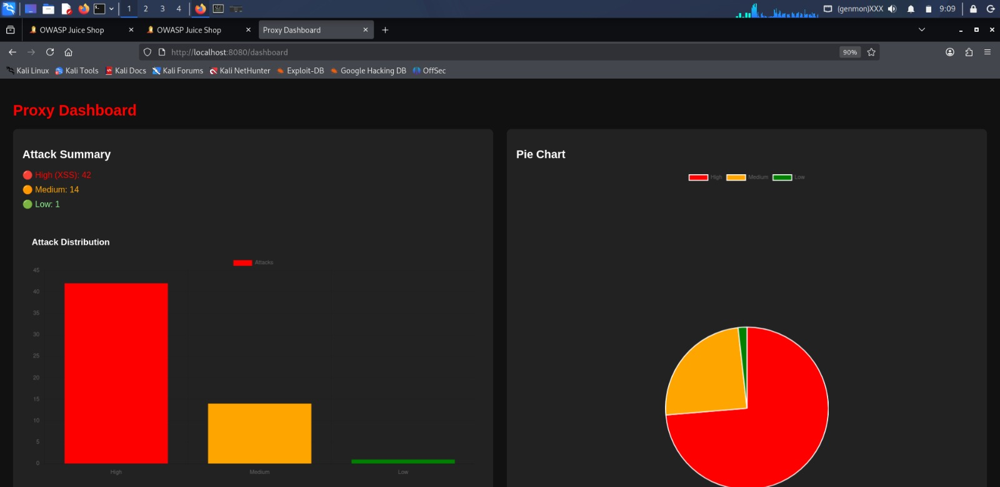
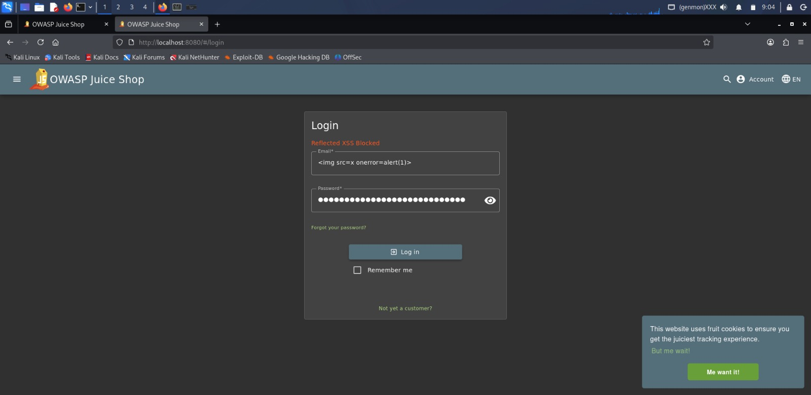
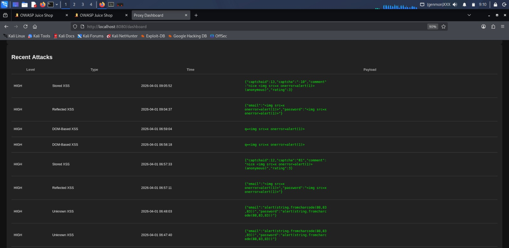

# 🚀 How to Use the Project

## 1. Prerequisites

Make sure the following are installed on your system:

- Python (3.x)
- pip (Python package manager)
- Docker (for running Juice Shop)

---

## 2. Install Dependencies

Open terminal in project folder and run:

pip install flask requests

---

## 3. Run the Target Application (Juice Shop)

We use OWASP Juice Shop as a vulnerable web application for testing.

### Step 1: Run using Docker

docker run -d -p 3000:3000 bkimminich/juice-shop

### Step 2: Open in browser

http://localhost:3000

---

## 4. Run the Proxy Server

Open another terminal in your project folder and run:

python app.py

Now your proxy runs on:

http://localhost:8080

---

## 5. Access the Application Through Proxy

Instead of opening Juice Shop directly, use:

http://localhost:8080

Now all requests go through your proxy.

---

## 6. Test XSS Attack

Try entering this in any input field (search, login, feedback):

### Expected Result:
- Attack will be blocked ❌
- Message like “Blocked” shown
- Attack will be logged

---

## 7. View Dashboard

Open:

http://localhost:8080/dashboard

### Dashboard Shows:
- Attack counts (High, Medium, Low)
- Graphs (Bar, Pie, Line)
- Recent attack logs

---

## 8. Logs File

All attacks are stored in:

xss_log.txt

---

---

# 📸 Output Screenshots

## Dashboard View

## Attack Blocked

## Logs Output
